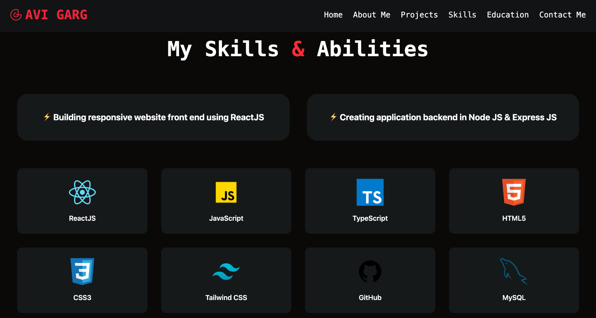
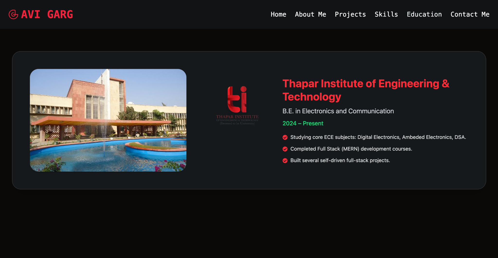

# 👨‍💻 Personal Portfolio Website - Avi Garg

Welcome to my personal developer portfolio website — a showcase of my skills, experiences, and projects, built using modern web technologies with a focus on responsive design and smooth user experience.

## 🚀 Tech Stack

- **ReactJS** – Core UI library
- **TypeScript** – Type-safe development
- **Tailwind CSS** – Utility-first CSS framework
- **DaisyUI** – Beautiful component library for Tailwind
- **React Router** – Seamless client-side routing
- **React Hook Form** – Fast, lightweight form validation
- **Framer Motion** – High-performance animations and transitions ✨
- **SVG Waves** – Stylish section dividers with custom SVGs

## 📸 Screenshots

## ✨ Features

- ⚡ Fast and fully responsive design
- 🎯 Smooth animations using **Framer Motion**
- 🔄 Page navigation with **React Router**
- ✅ Form validation with **React Hook Form**
- 🌊 Custom SVG wave dividers
- 🔗 External links to GitHub, LinkedIn, and Instagram
- 📱 Mobile-friendly and accessible layout

## 🌐 Live Demo

🔗 [Visit Website](https://portfolio-website-six-wheat-47.vercel.app/)

## 📁 Repository

🔗 [GitHub Repo](https://github.com/gargavi-oss/portfolio-website)

## 📬 Contact

Feel free to reach out via:
- 📧 Email: avigarg258@gmail.com
- 📞 Phone: +91-7404648978

---

💡 Feedback and contributions are always welcome.  
✨ Built with love, motion, and clean code.
