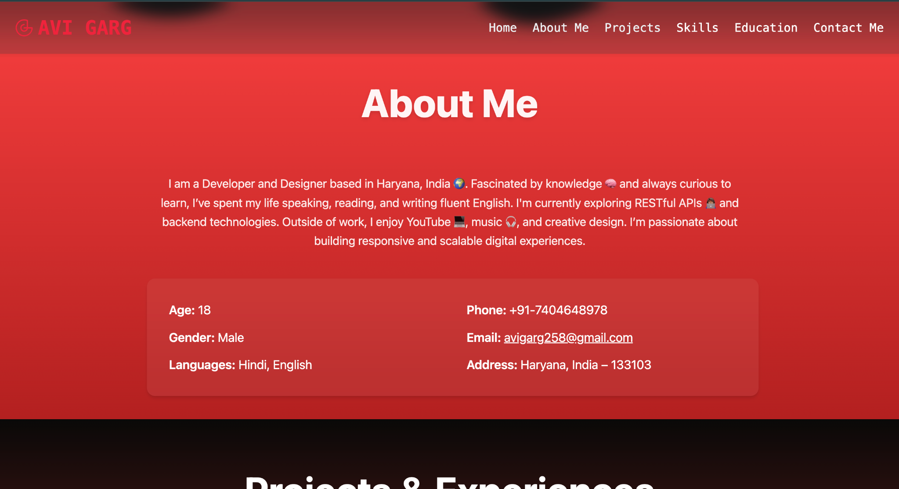
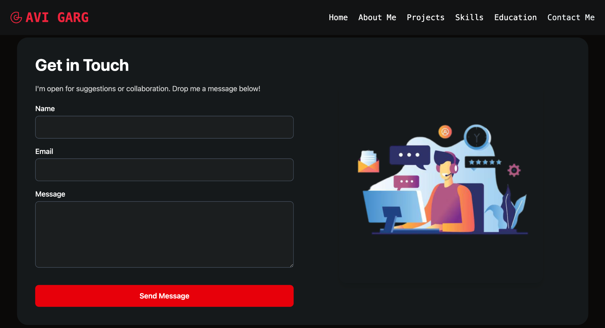

# 👨‍💻 Personal Portfolio Website - Avi Garg

Welcome to my personal developer portfolio website, built to showcase my skills, experience, and projects in a modern, interactive, and responsive way.

## 🚀 Tech Stack Used

- **ReactJS** – Core frontend library for UI
- **TypeScript** – Type-safe coding experience
- **Tailwind CSS** – Utility-first CSS for rapid styling
- **DaisyUI** – Prebuilt Tailwind CSS components for consistent design
- **SVG Waves** – Smooth, custom wave transitions for section designs

## 📸 Screenshots

## 🧠 Features

- Fully responsive across devices
- Smooth UI with modern animations
- Accessible design and clean layout
- Custom SVG wave effects
- Integrated contact form
- Social media links for GitHub, LinkedIn, and Instagram

## 📍 About Me

I'm a frontend and backend developer passionate about building modern web applications. I enjoy creating user-friendly, scalable, and elegant solutions.

## 📬 Contact

Feel free to reach out via the contact form or:
- 📧 avigarg258@gmail.com
- 📞 +91-7404648978

---

Feel free to fork or star this repo if you liked it!

